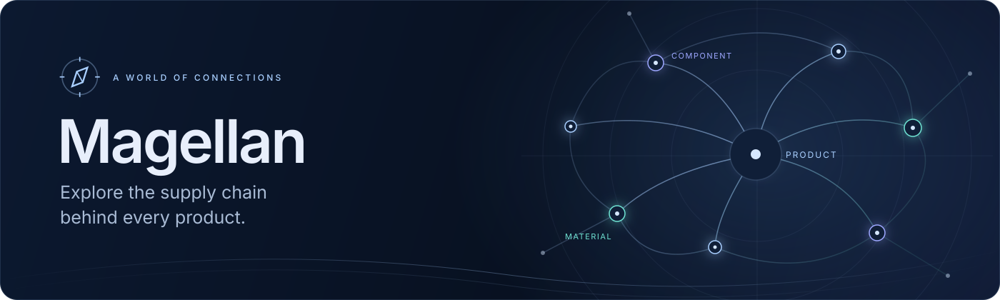
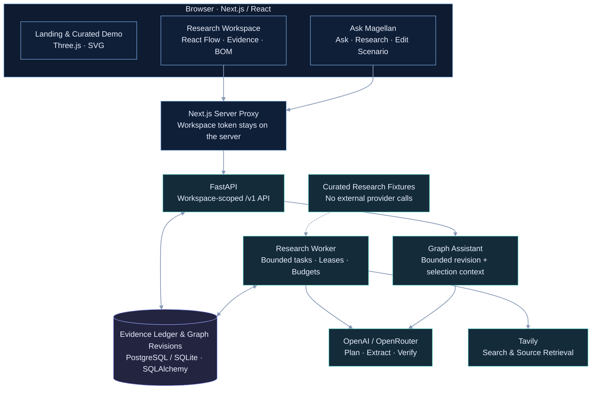
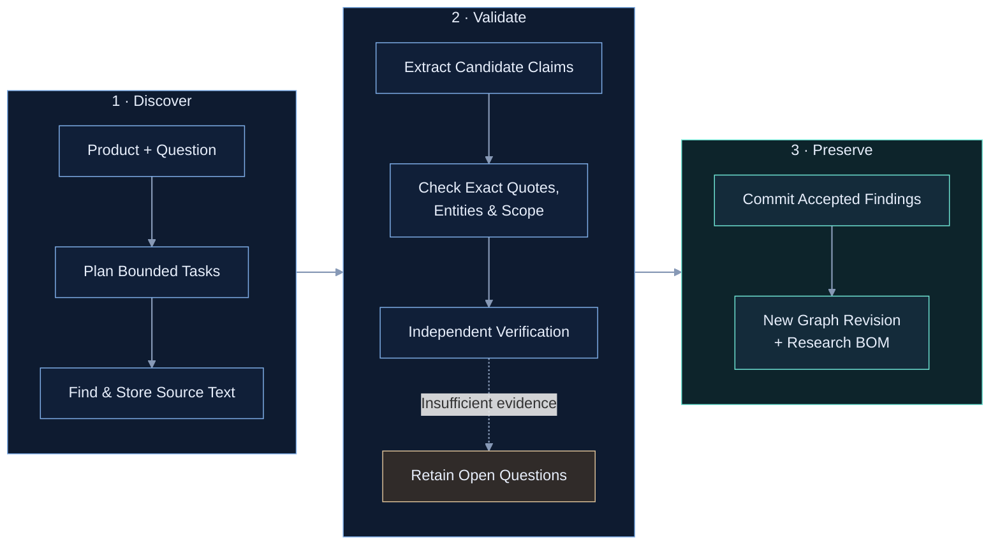
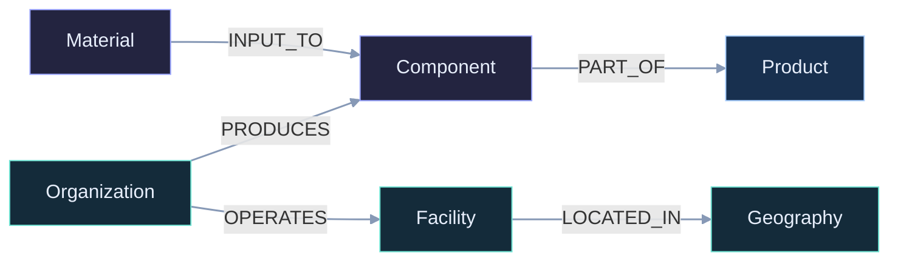

<p align="center">
  
</p>

<p align="center">
  <strong>Start with a product. Follow its components. Inspect the evidence behind every connection.</strong><br />
  An interactive supply chain research workspace, built at DNHacks 2026.
</p>

<p align="center">
  <a href="https://github.com/jcorm121/magellan-ai/actions/workflows/frontend.yml"></a>
  <a href="https://github.com/jcorm121/magellan-ai/actions/workflows/backend.yml"></a>
  
  
  
  
</p>

<p align="center">
  <a href="#the-experience">Experience</a> ·
  <a href="#quick-start">Quick Start</a> ·
  <a href="#architecture">Architecture</a> ·
  <a href="#the-graph-and-its-evidence">Graph &amp; Evidence</a> ·
  <a href="#development-and-validation">Development</a> ·
  <a href="#documentation">Documentation</a>
</p>

---

## The Experience

Magellan turns a product name into an explorable network of components, materials, organizations, and locations. Open a node to inspect its relationships, follow a connection to its source, or ask the graph assistant to investigate further. Missing evidence stays visible as an open question.

The interface shares a midnight navy palette, soft blue glows, locally bundled typography, and smooth SVG and Three.js animation across three experiences:

| Route                                                                        | Experience                 | What You Can Do                                                                                                                                        |
| :--------------------------------------------------------------------------- | :------------------------- | :----------------------------------------------------------------------------------------------------------------------------------------------------- |
| [`/home`](http://localhost:3000/home)                                        | **The Landing Page**       | Scroll through an animated iPhone decomposition, flowing waves, and a 3D globe. Components become glowing points and follow curved paths to the globe. |
| [`/demo`](http://localhost:3000/demo)                                        | **The iPhone Demo**        | Deconstruct an iPhone 17 Pro into six assemblies, select components, explore supplier connections, and inspect linked sources.                         |
| [`/`](http://localhost:3000) · [`/research`](http://localhost:3000/research) | **The Research Workspace** | Research a product, explore its interactive graph, inspect evidence, review a bill of materials, and work with the context-aware assistant.            |

**The landing page and curated demo work without model or search credentials.** The demo uses its own sourced, curated dataset. Globe pins represent approximate company headquarters; arcs illustrate component relationships, rather than verified factory locations or shipping routes. Older `/#network` and `/#bom` links forward to the corresponding demo stage.

### Explore, Inspect, Investigate

- **An interactive graph.** An Obsidian-inspired network with force-directed layout, draggable nodes, pan and zoom, search, entity filters, and a focused neighborhood view. New findings preserve existing node positions and your view.
- **Evidence at the point of use.** Inspect a relationship's claims, exact stored excerpts, source links, scope, support label, and caveats. Follow connected entities without losing your exploration.
- **A research bill of materials.** Browse discovered components and materials with their supporting evidence. Unresolved quantities remain unknown; incomplete research remains visibly incomplete.
- **Ask Magellan.** Ask about the current graph or selected entities, request follow-up research, and explore hypothetical edits in a separate scenario.
- **Saved explorations.** Reopen runs through direct URLs, resume research on existing findings, and export graph JSON pinned to the displayed revision.
- **Considered motion and access.** Keyboard controls, responsive layouts, reduced-motion behavior, an animated compass loading screen, and fallback illustrations when WebGL is unavailable.

## Quick Start

### Run Everything With Docker

From the repository root, with Docker Engine or Docker Desktop and the Compose plugin running:

```bash
docker compose up --build -d
```

This starts PostgreSQL, applies migrations, and launches the API, research worker, and frontend. The default **fixture provider requires no external API keys**.

| Open                                                    | Purpose                       |
| :------------------------------------------------------ | :---------------------------- |
| [localhost:3000/home](http://localhost:3000/home)       | Landing page                  |
| [localhost:3000/demo](http://localhost:3000/demo)       | Curated iPhone demo           |
| [localhost:3000](http://localhost:3000)                 | Research workspace            |
| [localhost:8000/docs](http://localhost:8000/docs)       | Interactive API documentation |
| [localhost:8000/healthz](http://localhost:8000/healthz) | API health check              |

**Try `Raspberry Pi 5` in the workspace.** The fixture produces a small, intentionally partial graph with three supported components. Other unrecognized products can return an unresolved product root and open questions; fixture mode is a deterministic development example, not a general research service.

```bash
docker compose logs -f api worker frontend
docker compose down
```

Stopping the stack preserves the PostgreSQL volume. On Windows, start Docker Desktop and enable WSL integration before running these commands from WSL.

### Run Locally

Use **Python 3.12+**, **Node.js 22.12+**, and **Bun 1.3.9**. The commands below assume a Bash-compatible shell and start in the repository root.

**Terminal 1 — backend:**

```bash
cd backend
python3 -m venv .venv
.venv/bin/pip install -r requirements-dev.lock
.venv/bin/pip install --no-deps -e .
test -f .env || cp .env.example .env
.venv/bin/uvicorn app.main:app --reload
```

By default, the backend uses a persistent local SQLite database, an embedded worker, and curated fixture research. Existing `.env` files keep their configured behavior.

**Terminal 2 — frontend:**

```bash
cd frontend
bun install --frozen-lockfile
test -f .env.local || cp .env.example .env.local
bun run dev
```

The frontend connects through two **server-only** settings in `frontend/.env.local`:

```dotenv
MAGELLAN_API_URL=http://127.0.0.1:8000
MAGELLAN_API_TOKEN=dev-token
```

The token must match a token in the backend's `WORKSPACE_TOKENS` mapping. It is attached by the Next.js server and never needs a `NEXT_PUBLIC_` prefix. To browse only the landing page and iPhone demo, running the frontend is sufficient.

## Live Research

Live research combines **Tavily search and page retrieval** with **OpenAI or OpenRouter models** for planning, structured extraction, and verification. Configure `backend/.env` using the [backend configuration guide](backend/README.md) and [environment template](backend/.env.example).

| Setting                                                                     | Role                                                                                                                         |
| :-------------------------------------------------------------------------- | :--------------------------------------------------------------------------------------------------------------------------- |
| `RESEARCH_PROVIDER=fixture` or `live`                                       | Choose deterministic examples or external research.                                                                          |
| `TAVILY_API_KEY`                                                            | Search and source retrieval for live research.                                                                               |
| `LLM_PROVIDER=openrouter`                                                   | Use `OPENROUTER_API_KEY` and `OPENROUTER_MODEL`.                                                                             |
| `LLM_PROVIDER=openai`                                                       | Use `OPENAI_API_KEY` and `OPENAI_MODEL`.                                                                                     |
| `*_VERIFIER_MODEL`, `*_PLANNER_MODEL`                                       | Optional role-specific models; verifier falls back to extraction, planner to verifier.                                       |
| `OPENROUTER_RESPONSE_FORMAT`                                                | `json_schema` by default; `json_object` is available for compatible JSON-only models. Local schema validation still applies. |
| `INPUT_TOKEN_COST_PER_MILLION_MINOR`, `OUTPUT_TOKEN_COST_PER_MILLION_MINOR` | Explicit billing estimates and OpenRouter price ceilings required for paid model IDs.                                        |

### DeepSeek V4 Flash Through OpenRouter

The following opt-in configuration uses [DeepSeek V4 Flash 0731](https://openrouter.ai/deepseek/deepseek-v4-flash-0731) for extraction, verification, planning, and graph assistance. Add your credentials locally; keep `.env` files out of version control.

```dotenv
RESEARCH_PROVIDER=live
LLM_PROVIDER=openrouter
TAVILY_API_KEY=your-tavily-key
OPENROUTER_API_KEY=your-openrouter-key
OPENROUTER_MODEL=deepseek/deepseek-v4-flash-0731
OPENROUTER_VERIFIER_MODEL=
OPENROUTER_PLANNER_MODEL=
OPENROUTER_RESPONSE_FORMAT=json_schema
OPENROUTER_REASONING=off
INPUT_TOKEN_COST_PER_MILLION_MINOR=14
OUTPUT_TOKEN_COST_PER_MILLION_MINOR=28
```

These rate ceilings are **14 and 28 USD cents per million tokens**: at most **$0.14 input / $0.28 output** for provider routing. They are operator-selected ceilings, not a promise of provider prices or a total-run spending cap. Existing run limits still apply. If adapting an existing `.env`, review per-role reasoning overrides and token budgets too.

Free OpenRouter routing uses zero-price ceilings. Paid routing requires explicit configuration; the backend does not silently switch to a paid model. Model availability, structured-output support, and account quotas depend on the selected provider.

After configuring live credentials, the container command is:

```bash
docker compose --env-file backend/.env up --build -d
```

Restart both the API and worker after configuration changes. For local development, restart Uvicorn and any separately launched worker. Advanced settings must also be present in the shared backend environment in [compose.yaml](compose.yaml) to reach containers.

## Architecture

The browser handles exploration and visualization. Next.js provides a same-origin API boundary with server-side credentials. FastAPI owns graph operations, research jobs, and evidence; workers perform bounded research outside database transactions.



**Updates stay consistent.** The frontend polls the run and graph, then reads the BOM at that graph revision. Inspections and exports use the same revision. The backend also exposes resumable server-sent event streams for API clients; the current frontend uses polling.

**Research survives beyond the page.** Jobs, events, claims, sources, and immutable graph revisions are persisted in a relational ledger. Docker runs a separate worker against PostgreSQL; local development defaults to an embedded worker and SQLite. Provider calls occur outside transactions, while graph commits and revision checks are serialized.

**The demo is independent.** Its procedural phone, globe geometry, and curated facts are frontend assets. An unavailable research provider does not prevent `/home` or `/demo` from rendering.

### From Question to Supported Connection



The cycle repeats for new research targets while depth, node, search, document, token, and time budgets allow. Cancellation, exhausted budgets, and provider failures preserve already committed findings. Search snippets help discover sources; they do not establish evidence for research-graph relationships.

## The Graph and Its Evidence

### A Typed Supply Chain

The graph has six node kinds: **product, component, material, organization, facility, and geography**. Relationships preserve direction and explicit product, company, or generic scope.

The following is an illustration of the schema, not a claim about a particular product:



Additional supported predicates are `MANUFACTURES`, `SUPPLIES`, `OWNED_BY`, and `PROCESSED_BY`. An edge's meaning comes from its predicate, evidence, and scope together.

### Provenance Is Part of the Data

| Record       | What It Preserves                                                                                       |
| :----------- | :------------------------------------------------------------------------------------------------------ |
| **Source**   | Retrieved document identity, URL, publisher information, timestamps, and content hash.                  |
| **Claim**    | An exact stored excerpt, the entities and relationship it supports, scope, rationale, and review state. |
| **Edge**     | Directed relationship, supporting claim IDs, evidence summary, support label, and provenance metadata.  |
| **Revision** | A stable graph snapshot for inspection, export, historical comparison, and reproducible BOM views.      |

Support labels distinguish `directly_supported`, `strongly_inferred`, `weakly_inferred`, `disputed`, `user_asserted`, and `unresolved`. Imported rows and hypothetical changes carry user-asserted provenance. Edge confidence is a recorded heuristic derived from evidence, not a calibrated probability or a model's self-rating.

**A research BOM is a view of discovered evidence.** Its coverage describes support for returned rows, not completeness of the physical product. Unknown quantities, uncertain locations, and gaps in sourcing are kept explicit.

The backend also offers a separate **text, link, or photo BOM estimator**. It labels items as evidenced, inferred, or guessed and can import them into research. Those estimates and user uploads are distinct from verified public-source findings; their full input flows are not yet exposed in the frontend.

## Work With the Graph Assistant

Open **Ask Magellan** in an exploration, or select a node or relationship and choose **Ask Magellan About This**.

| Mode              | Example                                           | Behavior                                                                                                                                    |
| :---------------- | :------------------------------------------------ | :------------------------------------------------------------------------------------------------------------------------------------------ |
| **Ask**           | “Which relationships have the weakest evidence?”  | Answers using a bounded snapshot of the graph, selected entities, evidence, and recent conversation. References link back to graph details. |
| **Research**      | “Investigate the manufacturer of this component.” | Starts follow-up research on the graph and adds supported findings as the run progresses.                                                   |
| **Edit Scenario** | “Replace this processor with an alternative.”     | Applies hypothetical changes to a separate scenario graph, preserving the original research graph.                                          |

Scenarios can be reopened and reset in the workspace; the API also supports discarding them. Follow-up research can investigate a scenario; its BOM becomes available after a run on that scenario. Conversation history lasts while the current exploration remains open.

Chat explanations are model-generated answers, not new verified claims. Research and scenario actions use dedicated backend endpoints. The fixture provider supplies an explicitly labeled deterministic preview; live-provider failures are shown rather than replaced with invented answers.

## API at a Glance

The primary backend is **FastAPI on port 8000**. Authenticated routes use `Authorization: Bearer <workspace-token>`; local defaults use `dev-token`. The running [Swagger UI](http://localhost:8000/docs) and [generated OpenAPI schema](http://localhost:8000/openapi.json) describe the implemented API, including newer graph-assistant endpoints.

| Endpoint                                    | Purpose                                                       |
| :------------------------------------------ | :------------------------------------------------------------ |
| `POST /v1/bom/decompose`                    | Start product research and receive run and graph IDs.         |
| `GET /v1/runs/{run_id}`                     | Read status, progress, stop reasons, and open questions.      |
| `GET /v1/runs/{run_id}/bom`                 | Read the research BOM, optionally pinned to a graph revision. |
| `GET /v1/runs/{run_id}/events`              | Subscribe to persisted research events through SSE.           |
| `GET /v1/graphs/{graph_id}`                 | Read the graph snapshot and revision.                         |
| `GET /v1/graphs/{graph_id}/edges/{edge_id}` | Inspect a relationship and its evidence.                      |
| `GET /v1/graphs/{graph_id}/export`          | Export graph JSON.                                            |
| `POST /v1/graphs/{graph_id}/chat`           | Ask about the current graph and selection.                    |
| `POST /v1/graphs/{graph_id}/research`       | Request follow-up research.                                   |
| `POST /v1/graphs/{graph_id}/scenarios`      | Create a hypothetical fork.                                   |
| `POST /v1/graphs/{graph_id}/edits`          | Apply a natural-language edit to a scenario.                  |
| `POST /v1/bom`                              | Create a separately labeled BOM estimate.                     |

Start a fixture exploration from a terminal:

```bash
curl --request POST http://localhost:8000/v1/bom/decompose \
  --header 'Authorization: Bearer dev-token' \
  --header 'Content-Type: application/json' \
  --header 'Idempotency-Key: readme-raspberry-pi-5' \
  --data '{"product":"Raspberry Pi 5","limits":{"max_hops":3,"max_nodes":50}}'
```

The initial response is `202 Accepted` with resource IDs and URLs. Poll the returned run to follow progress. Reusing an idempotency key with the same request replays the existing result; use a new key for a new exploration. Lower-level graph mutations also enforce revision checks to avoid overwriting newer changes.

## Repository Map

```text
magellan-ai/
├── frontend/                     Next.js application
│   ├── src/app/                  Workspace, /home, /demo, /research, API proxy
│   ├── src/components/           Graph, evidence, BOM, assistant, landing, demo
│   ├── src/lib/                  API client, state, graph layout, Three.js scenes
│   ├── public/assets/            Local globe geometry and curated assets
│   └── tests/e2e/                Desktop and mobile browser workflows
├── backend/                      Primary Python / FastAPI service
│   ├── app/                      API, graph ledger, workers, providers, assistant
│   ├── migrations/               Alembic database migrations
│   ├── tests/                    API, evidence, workflow, and provider tests
│   ├── docs/                     Evidence metadata and research implementation notes
│   └── scripts/                  Research and data-capture utilities
├── backend-node/                 Earlier Next.js backend, retained for reference
├── docs/                         Design vision, API contracts, schemas, README art
├── .github/workflows/            Frontend and backend CI
└── compose.yaml                  PostgreSQL, migrations, API, worker, frontend
```

The frontend uses **Next.js 16, React 19, TypeScript, React Flow, Three.js, and Zustand**. The backend uses **FastAPI, Pydantic, SQLAlchemy, and Alembic**. PostgreSQL stores the containerized deployment; SQLite keeps local setup lightweight. A separate graph database is not required.

`backend-node/` is historical reference material. Current setup instructions and browser integration target the Python backend.

## Development and Validation

Run the checks for the part of the project you change. Provider behavior is tested with fixtures and mocks, so routine validation does not need paid API access.

**Frontend — from `frontend/`:**

```bash
bun run typecheck
bun run lint
bun run format:check
bun run test
bun run build
```

Use `bun run test` to invoke Vitest; the native `bun test` runner does not use this project's Vite test configuration.

**Backend — from `backend/`:**

```bash
.venv/bin/ruff check app tests migrations
.venv/bin/ruff format --check app tests migrations
.venv/bin/pytest -q
```

**Browser workflows — from `frontend/`, with `backend/.venv` installed:**

```bash
bunx playwright install --with-deps chromium
bun run test:e2e
```

Playwright starts isolated frontend and API servers on ports **3100** and **8100**, uses a temporary SQLite database, and exercises desktop and mobile flows. Its `.next-e2e` build directory stays separate from the developer server. Backend CI runs against SQLite and PostgreSQL and checks Alembic migrations; frontend CI runs static checks, unit tests, a production build, and browser tests.

When contributing, keep evidence and uncertainty visible, preserve the distinction between researched facts and hypothetical edits, and exercise the relevant fixture workflow alongside automated checks.

## Troubleshooting

| Symptom                                                | What to Check                                                                                                                                   |
| :----------------------------------------------------- | :---------------------------------------------------------------------------------------------------------------------------------------------- |
| Only a product root appears in fixture mode            | Try `Raspberry Pi 5`. Unrecognized products intentionally retain unknowns rather than inventing components.                                     |
| Live research stops with no nodes                      | Inspect the UI failure message, run `stop_reason`, `open_questions`, and `GET /v1/runs/{run_id}/history`. Confirm both search and model access. |
| `provider_quota_exhausted`                             | Restore allowance for the affected provider. Tavily's usage limit is independent of model quota; switching models cannot restore search access. |
| `provider_rate_limited`                                | Temporary throttling; retry after the provider's wait period. Daily quota failures need an allowance change.                                    |
| `provider_model_unavailable` or `model_output_invalid` | Check the model ID, account access, structured-output format, and reasoning/output budgets in the backend guide.                                |
| Workspace requests return 502 or 503                   | Check API health, `MAGELLAN_API_URL`, and the server-side workspace token; inspect API and frontend logs.                                       |
| `/demo` returns 404 after a merge                      | Restart Next.js from `frontend/` with Node.js 22.12+. `/demo` is a real App Router page.                                                        |
| Configuration changes have no effect                   | Restart the API and worker. For Docker, recreate services with the same `--env-file` and confirm the variables are forwarded by Compose.        |

**Retry Research** starts a follow-up on the existing graph and preserves committed findings. The curated demo remains available while live providers are unavailable.

## Current Scope

This is a **local/private, single-workspace MVP**. The frontend uses one configured backend workspace token. A public multi-user deployment needs application authentication and per-user workspace authorization at the server boundary. Container ports bind to loopback by default; the backend guide covers explicit production tokens, migrations, and separate workers.

Graph chat, follow-up research, and hypothetical scenario edits are implemented. Portfolio management, live market-price feeds, quantified shock propagation, and the full persistent agent-session/proposal protocol remain future work. The featured globe uses curated geography; projecting arbitrary research graphs into that experience is also future work.

## Documentation

| Guide                                                                                                        | Use It For                                                                                                         |
| :----------------------------------------------------------------------------------------------------------- | :----------------------------------------------------------------------------------------------------------------- |
| [Frontend Guide](frontend/README.md)                                                                         | Routes, interaction details, scene structure, environment settings, and browser testing.                           |
| [Backend Guide](backend/README.md)                                                                           | Provider configuration, research limits, persistence, graph operations, and deployment.                            |
| [API Specification](docs/API_SPEC.md) · [Static OpenAPI Contract](docs/openapi.yaml)                         | Original API design and contract. Use the running `/docs` for implemented additions.                               |
| [Project Vision](docs/PROJECT_OVERVIEW.md)                                                                   | Broader product direction and planned features; some architecture descriptions predate the current implementation. |
| [Edge Provenance and Confidence](backend/docs/EDGE_METADATA.md)                                              | Evidence metadata, support aggregation, and confidence calculation.                                                |
| [Parallel Research](backend/docs/PARALLEL_RESEARCH.md) · [Deeper Graphs](backend/docs/DEEPER_GRAPHS_PLAN.md) | Research scheduling, limits, and implementation plans.                                                             |
| [iPhone Research Run Notes](backend/docs/LIVE_RUN_2026-09-06.md)                                             | Recorded backend research and data-capture notes, separate from the curated frontend demo.                         |
| [Frontend Assets](frontend/public/assets/README.md)                                                          | Local media, map geometry, and asset conventions.                                                                  |

---

<p align="center"><strong>Magellan</strong> · Follow the connections. Keep the evidence.</p>
